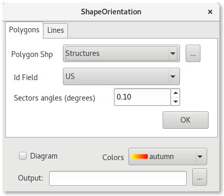
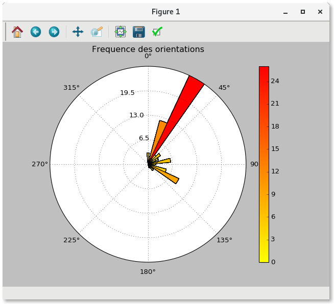
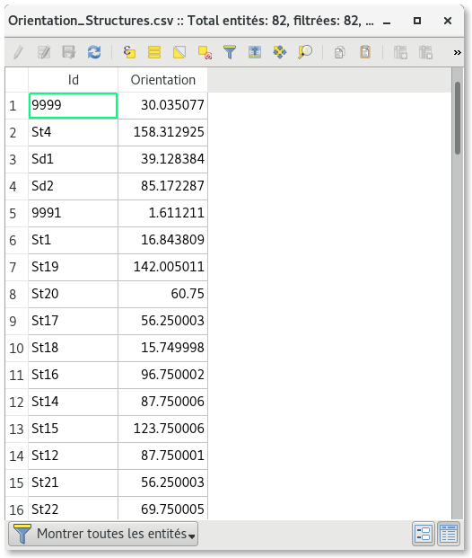

.. ShapeOrientation documentation master file, created by
   sphinx-quickstart on Sun Feb 12 17:11:03 2012.
   You can adapt this file completely to your liking, but it should at least
   contain the root `toctree` directive.

Welcome to ShapeOrientation's documentation!
============================================

Contents:

.. toctree::
   :maxdepth: 2

Introduction
=================

The ShapeOrientation plugin enables the computation of azimuth for lines and polygons ( shapefiles .shp). It  creates a table with azimuth for all features in the shapefile selected, and can draw a rose diagram with matplotlib to visualize the distribution of these directions.
Not the same as LineDirectionHistogram plugin, the computation of the polygon features is for the main direction of the polygon, not for his edges.

The dialog box
======================

The plugin requires four initial parameters:
 
* a shp file: **Polygon Shp** or **Line Shp**

* The field for identify each feature in the created table : **Id Field**

* The sectors angles in degrees to compute the distribution of directions: **Sectors Angles**

* The location for the output files: **Output**

You can generate a rose diagram with the optional check box **Diagram**, and select a color ramp. You can save it in png, svg, jpeg, pdf and more.

The **OK** button launches the program and loads the table into the legend dialog, and if Diagram is checked generates a Rose Diagram.

The **OK** button launches the program and loads the table into the legend dialog, and if Diagram is checked generates a Rose Diagram.

For polygons features it computes a diagram between 0 and 180 degrees cause a polygon have axe of orientation but no direction (two directions are possibles). For the lines it computes a diagram between 0 and 360 degrees : the first point to the last point so it is supposed that the line have only two points and a direction.

Source
=================

The source code can be found at the following address: 

https://github.com/FFouriauxEveha/ShapeOrientation

About
========

Design/Developpement: F. Fouriaux

Indices and tables
==================

* :ref:`genindex`
* :ref:`modindex`
* :ref:`search`

